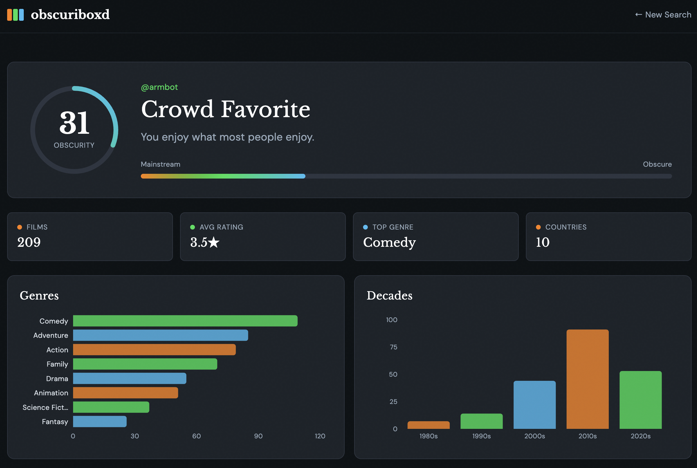

# Obscuriboxd 🎬

**Discover how unique your Letterboxd film taste really is.**

Obscuriboxd analyzes your Letterboxd profile to calculate your personal obscurity score and provide detailed insights into your viewing habits. Are you a "Crowd Favorite" who enjoys mainstream hits, or a "Deep Cuts Connoisseur" with obscure taste? Find out!



## ✨ Features

### 📊 Obscurity Score
Get a personalized score from 0-100 that measures how mainstream or obscure your film taste is:
- **0-30**: Crowd Favorite - You enjoy what most people enjoy
- **31-60**: Balanced Viewer - A mix of popular and niche films
- **61-100**: Deep Cuts Connoisseur - You seek out the obscure and unique

### 📈 Comprehensive Analytics

**Personal Profile**
- Obscurity score with visual dial indicator
- Personalized persona based on your taste
- Mainstream ↔ Obscure spectrum visualization

**Key Metrics**
- Total films analyzed
- Average rating across all films
- Top genre preference
- Countries represented in your watchlist

**Visual Breakdowns**
- **Genre Distribution**: See which genres dominate your viewing habits
- **Decade Analysis**: Discover your favorite film eras
- **Country Breakdown**: Explore the diversity of your film origins
- **Rating Distribution**: Understand your rating patterns
- **Mood Analysis**: Get insights into the emotional tone of your preferences

**Film Highlights**
- **Most Obscure Films**: Your deepest cuts and hidden gems
- **Most Mainstream Films**: Your popular favorites
- **Films by Decade**: Organized view of your collection across time periods
- **Top Directors**: Your most-watched filmmakers

## 🎯 How It Works

1. **Enter Your Letterboxd Username**: Simply provide your Letterboxd username
2. **Analysis**: Obscuriboxd fetches your complete film list and analyzes:
   - Watch counts from Letterboxd (measures popularity)
   - Genres, directors, countries, and decades
   - Your personal ratings and viewing patterns
3. **Obscurity Calculation**: Uses median watch counts to determine how obscure your taste is
4. **Personalized Results**: Get your unique obscurity score and detailed breakdowns

## 🛠️ Technologies

### Backend
- **FastAPI** - Modern Python web framework for the API
- **SQLite** - Lightweight database for film metadata caching
- **aiohttp** - Asynchronous HTTP client for web scraping
- **BeautifulSoup** - HTML parsing for Letterboxd data extraction
- **TMDb API** - Movie database integration for poster images

### Frontend
- **Next.js 14** - React framework with App Router
- **TypeScript** - Type-safe JavaScript
- **Tailwind CSS** - Utility-first CSS framework
- **Recharts** - Beautiful, composable charting library
- **Vercel Analytics** - Performance and usage tracking

### Infrastructure
- **Render** - Backend hosting and deployment
- **Vercel** - Frontend hosting and deployment
- **GitHub** - Version control and CI/CD

## 🏗️ Architecture

### Database-First Approach
- **Pre-populated Database**: Contains metadata for thousands of films
- **Smart Caching**: Films are pulled from the database when available
- **On-Demand Scraping**: Only scrapes missing or incomplete films
- **Automatic Updates**: Database grows as new films are discovered

### API Endpoints
- `POST /analyze` - Analyze a Letterboxd username and return obscurity stats
- `GET /stats` - Get database statistics
- `GET /films` - List films in the database (with pagination)
- `GET /health` - Health check endpoint

## 📊 Data Sources

- **Letterboxd**: Primary source for user film lists, watch counts, and ratings
- **TMDb (The Movie Database)**: Fallback source for film posters
- **Comprehensive Database**: Pre-scraped film metadata for fast lookups

## 🚀 Quick Start

### Prerequisites
- Node.js 18+ and npm
- Python 3.9+
- Letterboxd account

### Local Development

**Backend:**
```bash
cd backend
python -m venv venv
source venv/bin/activate  # On Windows: venv\Scripts\activate
pip install -r requirements.txt
uvicorn main:app --reload
```

**Frontend:**
```bash
cd frontend
npm install
npm run dev
```

Visit `http://localhost:3000` to see the app.

## 📝 License

This project is open source and available for personal use.

## 🙏 Acknowledgments

- **Letterboxd** - For providing an amazing platform for film lovers
- **TMDb** - For comprehensive film metadata
- Built with ❤️ for the film community

---

**Made for film lovers, by film lovers.** 🎥
